

# 
TUS CLASS(Unofficial)

TUS CLASS front-end APP
 

    
    

 

## Contents

  - [Installation](#installation)
  - [Introduction](#introduction)
  - [Features](#features)
  - [Issues](#issues)
  - [TODO](#todo)

## Installation

[0.0.6] Beta: [TestFlight](https://testflight.apple.com/join/km2DnJZf) (**IOS ONLY**)

> Sorry for Android users, though we have already built Android version, since this is a unofficial APP, to avoid complex problems.  
> We will release Android version in the future.

## Introduction

A front-end APP for [TUS CLASS](https://class.admin.tus.ac.jp/up/faces/login/Com00501A.jsp). This Project is only for Tokyo University of Science students.  
Powered by [Flutter](https://flutter.dev/), support for both **iOS** and **Android**.

This is my first mobile application, so it maybe buggy or what else.  
This repo isn't open source now, but will open source in some day(code just not beautiful currently).

<table><tr>
  <td style="text-align: center">
    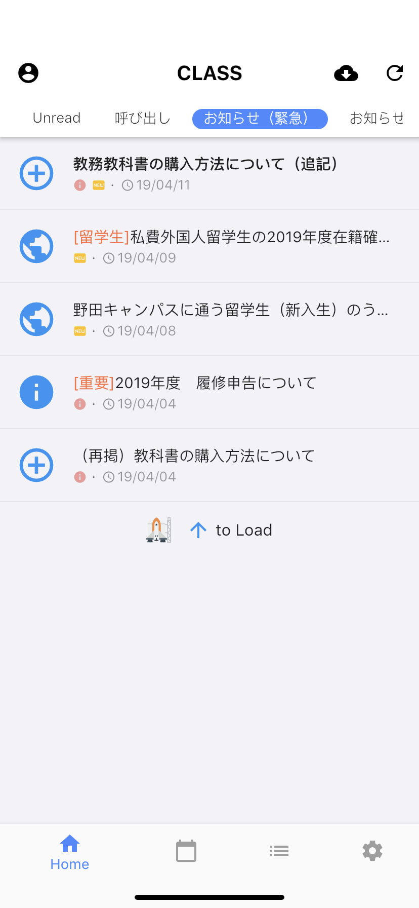
  </td>
  <td style="text-align: center">
    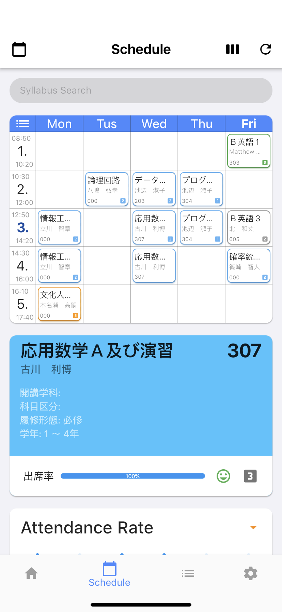
  </td>
  <td style="text-align: center">
    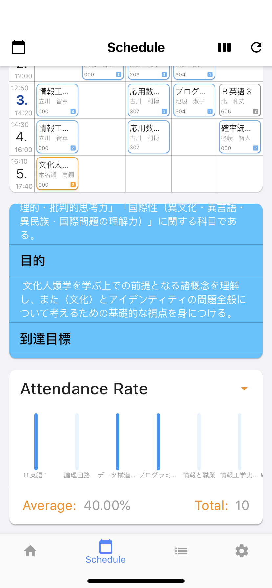
  </td>
  <td style="text-align: center">
    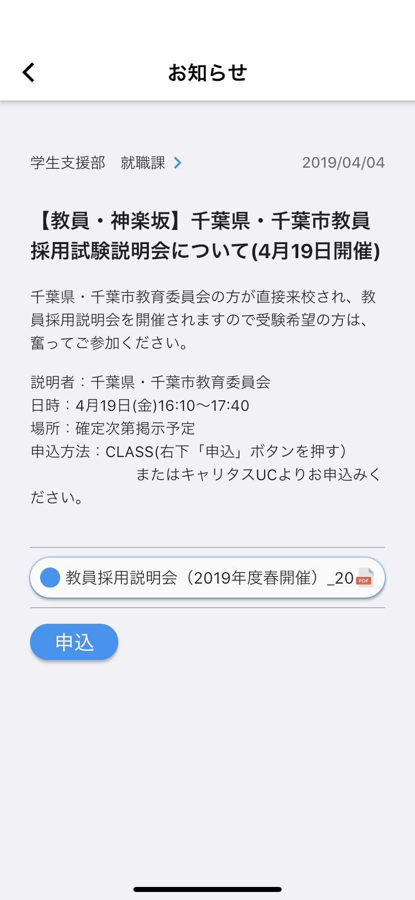
  </td>
</tr></table>

<table><tr>
  <td style="text-align: center">
    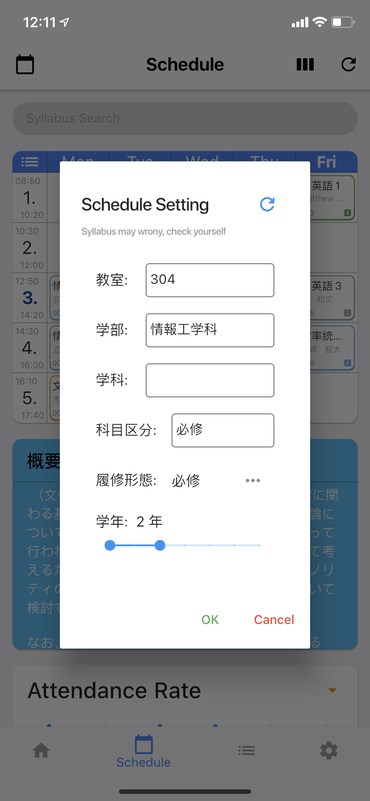
  </td>
  <td style="text-align: center">
    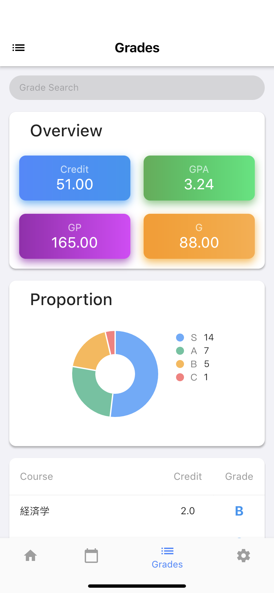
  </td>
  <td style="text-align: center">
    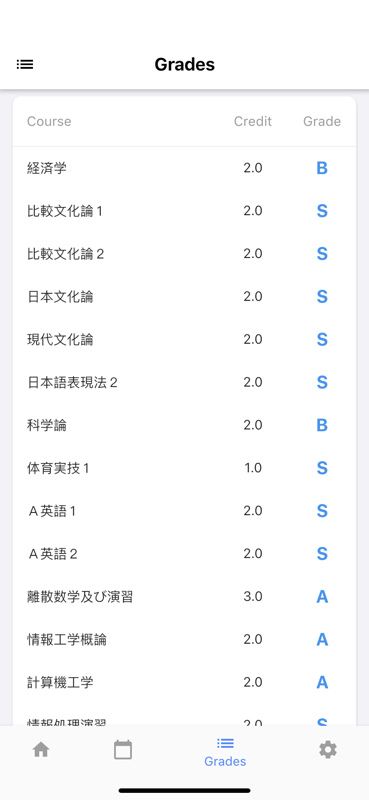
  </td>
  <td style="text-align: center">
    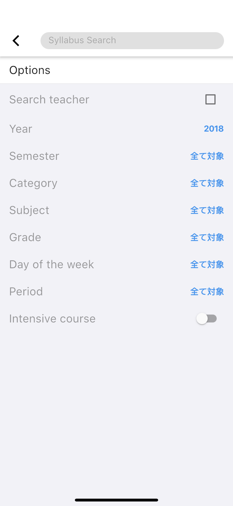
  </td>
</tr></table>

<table><tr>
  <td style="text-align: center">
    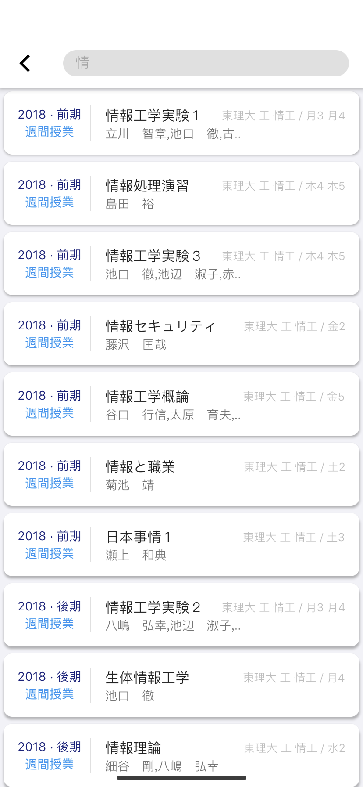
  </td>
  <td style="text-align: center">
    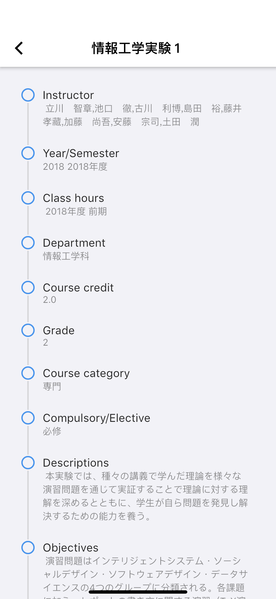
  </td>
  <td style="text-align: center">
    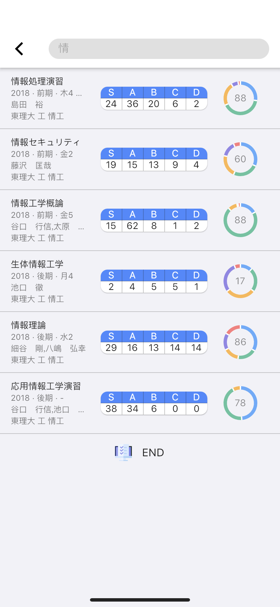
  </td>
  <td style="text-align: center">
    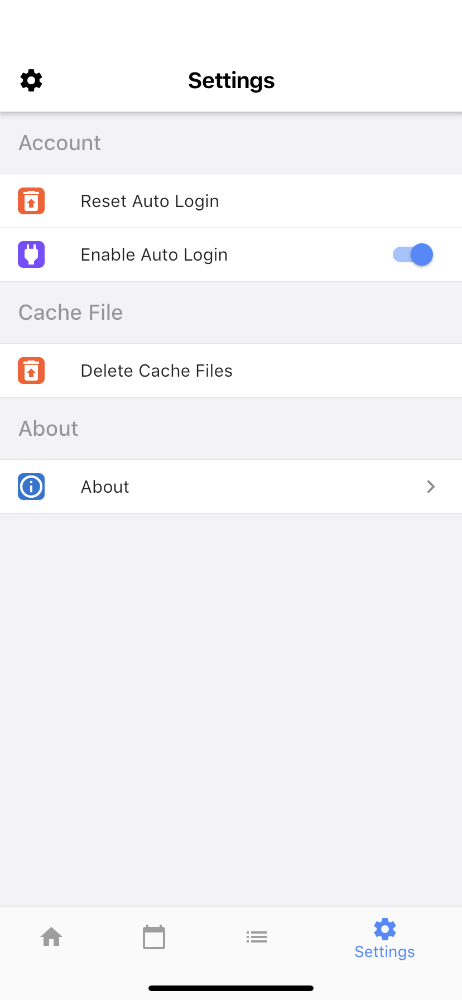
  </td>
</tr></table>

## Features

- Messages
  - PDF files
  - Other files (if your have APP supports)
  - Application
- Schedules
  - Attendance Rate
- Grades
- Grade Search
- Syllabus
- Syllabus Search
- Auto Login

## Issues

Please file any issues, bugs, or feature requests in the [Issues](https://github.com/huhugiter/TUS_CLASS/issues).

### Known bugs / issues

- search will return no result whatever the exception is
- Unread messages will only show index page messages if you not load all message(by cloud download icon)

## FAQs

### How to configure schedule

By longpress the cell in table.

### Icons on top left not working

Current time the icons(on top left) are just decorations.

### Can't search

Tap the textfield, the keyboard will popup, then tap finish or search key on keyboard

### How this APP store my password

Using Flutter package: [flutter_secure_storage](https://pub.dartlang.org/packages/flutter_secure_storage)

- Keychain is used for iOS
- AES encryption is used for Android. AES secret key is encrypted with RSA and RSA key is stored in KeyStore

Note KeyStore was introduced in Android 4.3 (API level 18). The plugin wouldn't work for earlier versions.

## TODO

- [ ] I18N
- [ ] Theme
- [ ] version check
- [ ] course may have more than one period
- [ ] schedule table cell customize
- [ ] more user-friendly Exception handle
