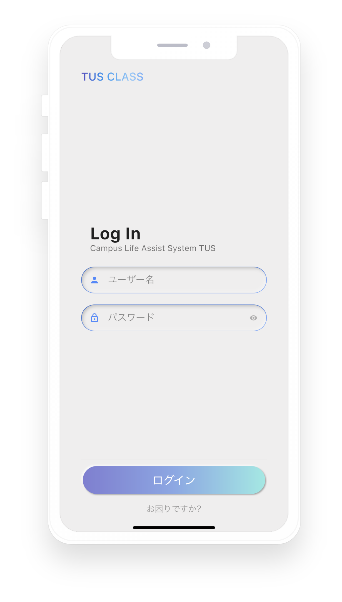
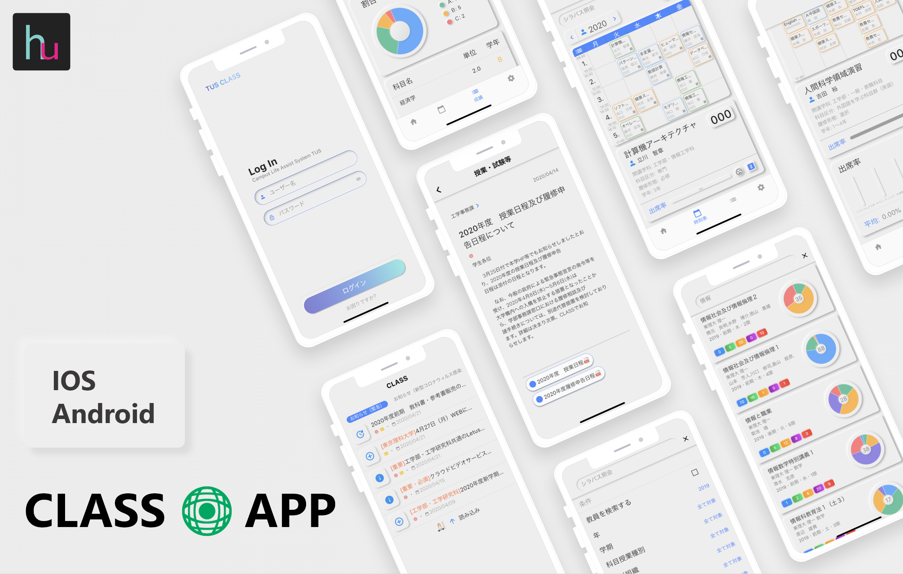

<h1 align="center">TUS CLASS(Unofficial)</h1>  

  

  TUS CLASS Front-end APP  
  Made with ❤️ and Flutter

  

  

## Table of Contents

- [Table of Contents](#table-of-contents)
- [Introduction](#introduction)
- [Features](#features)
- [Issues](#issues)
  - [Known bugs / issues](#known-bugs--issues)
- [Contributing](#contributing)
- [FAQs](#faqs)
- [Todo](#todo)
- [License](#license)

## Introduction

A Front-end APP for [TUS CLASS](https://class.admin.tus.ac.jp/up/faces/login/Com00501A.jsp). This project is only for Tokyo University of Science students. Powered by [Flutter](https://flutter.dev/)

**Available for both iOS and Android.**

  

## Features

- 📨Messages
  - 📕PDF files
  - 📚Other files (if your have APP supports)
  - 🎈Entry
- 📅Timetable
  - 💯Attendance Rate
- 🏆Grades
- 🔎Grade Search
- 📝Syllabus
- 🔎Syllabus Search
- 🔐Auto Login

## Issues

> :exclamation: **Important**: Only the Faculty of Engineering is currently tested. There may be a lot of places without adaptation!

If you meet any bugs or issues, please contact with developer, or file an issue and describe what operation caused the bugs.Please file any issues, bugs, or feature requests in the [Issues](https://github.com/huhugiter/TUS_CLASS/issues). Thx :kissing_heart:

### Known bugs / issues

- For each subject, the form of the timetable may slightly **different** and needs to be implemented
- Because the website is “single-threaded" (you can't back or move forward), be sure to wait for the loading to complete (e.g. timetable will only load once and be cached)

## Contributing

Pull requests are welcome. For major changes, please open an issue first to discuss what you would like to change.

Please make sure to update tests as appropriate.

## FAQs

- **How this APP work**
  - Fetching data from CLASS using regular expression, and simulate web page submission.
- **How to configure schedule**
  - By longpressing the cell in table.
- **Can't search**
  - Tap the textfield, the keyboard will popup, then tap finish or search key on keyboard
- **How this APP store my password**
  - Using Flutter package: [flutter_secure_storage](https://pub.dartlang.org/packages/flutter_secure_storage)
    - Keychain is used for iOS
    - AES encryption is used for Android. AES secret key is encrypted with RSA and RSA key is stored in KeyStore
  - Note KeyStore was introduced in Android 4.3 (API level 18). The plugin wouldn't work for earlier versions.

## Todo

- [x] I18N
- [x] Course may have more than one period
- [ ] Theme
- [ ] Version check
- [ ] Schedule table cell customize
- [ ] More user-friendly Exception handle

## License

[MIT](https://choosealicense.com/licenses/mit/)
